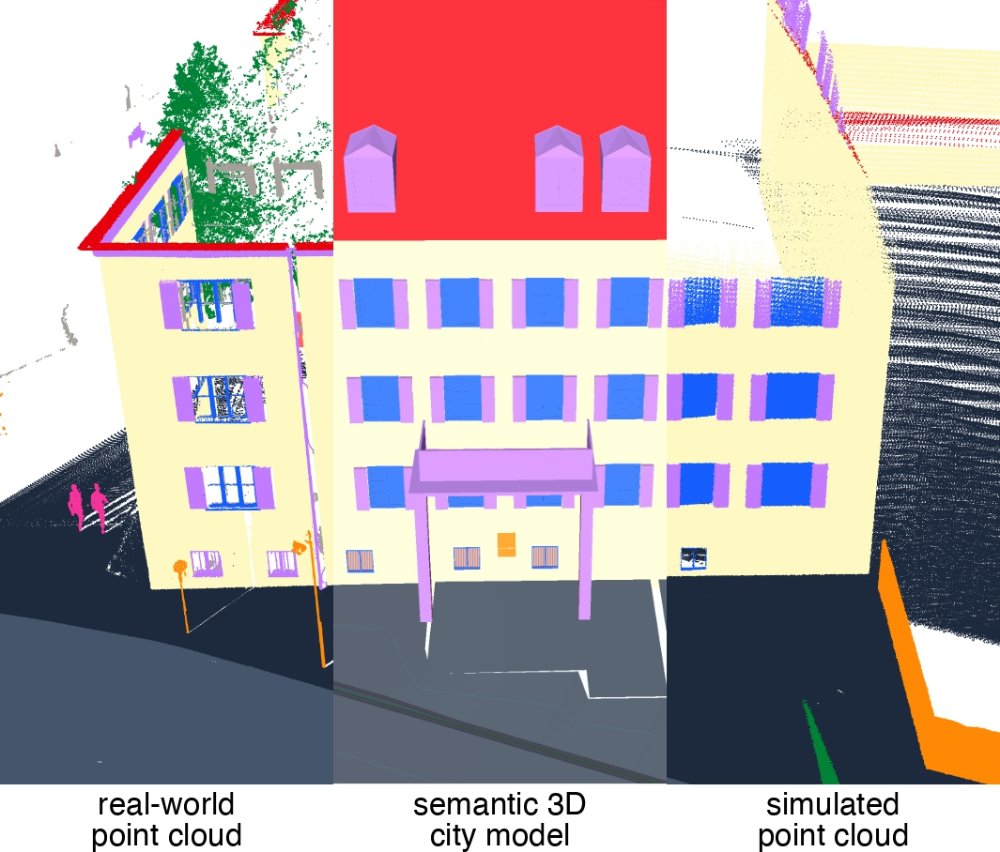
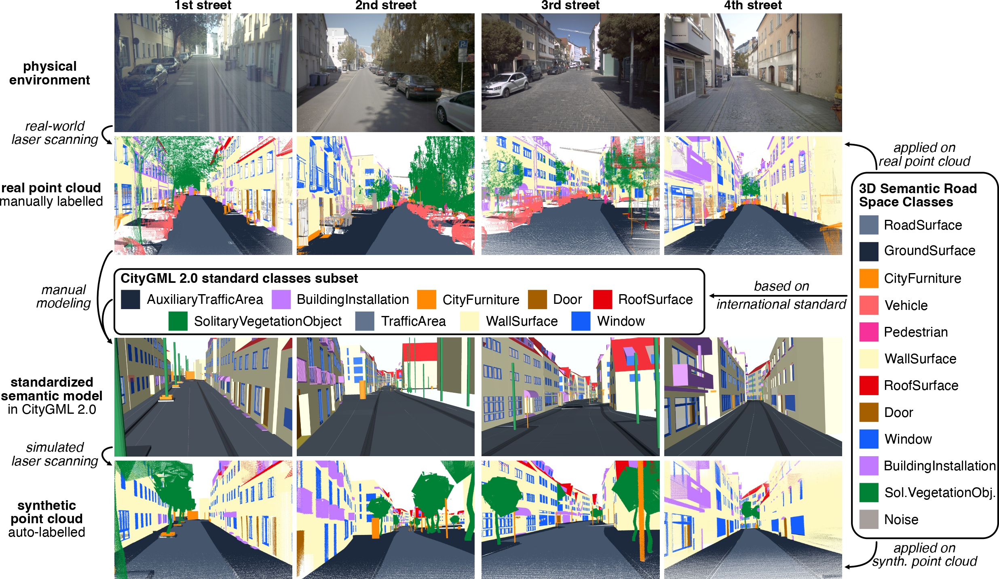

# TrueCity: Real and Simulated Urban Data for Cross-Domain 3D Scene Understanding

**Accepted to 3DCV 2025**

<p align="center">
  | <a href="figures/paper.pdf"><strong>Paper</strong></a>                  |
  | <a href="https://github.com/tum-gis/TrueCity"><strong>Code</strong></a> |
  <strong>Dataset (Coming Soon)</strong>
</p>

<p align="center">
  
</p>

<p align="center">
  <em>TrueCity introduces real-world annotated point clouds, a semantic 3D city model, and 3D-model simulated point clouds of the same location, enabling coherent evaluation of the sim-to-real domain gap in 3D scene understanding.</em>
</p>

## Abstract


We introduce TrueCity, the first urban semantic segmentation benchmark with cm-accurate annotated real-world point clouds, semantic 3D city models, and annotated simulated point clouds representing the same city. TrueCity proposes segmentation classes aligned with international 3D city modeling standards, enabling consistent evaluation of synthetic-to-real gap. Our extensive experiments on common baselines quantify domain shift and highlight strategies for exploiting synthetic data to enhance real-world 3D scene understanding.

## TrueCity Benchmark Dataset

<p align="center">
  
</p>

<p align="center">
  <em>Real-world point cloud (2nd row), which was manually labeled according to the class list, used for manual modeling of semantic 3D models (3rd row), which in turn were used to simulate and auto-label synthetic point clouds (4th row).</em>
</p>

TrueCity proposes a class list of **12 classes** harmonized with the standards **CityGML 2.0** and **OpenDRIVE 1.4**:


## Experiments

<p align="center">
  
</p>

<p align="center">
  <em>Top-down schematic of S--R mixtures along a continuous streetscape. Solid lines mark train/validation/test splits; dashed lines mark boundaries between contiguous synthetic and real segments for each mixture ratio.</em>
</p>


## Results

|         Model          | 100S--0R |        | 75S--25R |           | 50S--50R  |           | 25S--75R  |           | 0S--100R  |           |
| ---------------------- | -------- | ------ | -------- | --------- | --------- | --------- | --------- | --------- | --------- | --------- |
|                        | **mIoU** | **OA** | **mIoU** | **OA**    | **mIoU**  | **OA**    | **mIoU**  | **OA**    | **mIoU**  | **OA**    |
| **Point-based**        |          |        |          |           |           |           |           |           |           |           |
| PointNet               | 6.03     | 30.36  | 10.74    | 48.10     | 10.89     | 49.29     | 13.10     | 47.99     | **14.51** | **49.82** |
| PointNet++             | 9.72     | 34.39  | 20.95    | 62.80     | 23.18     | **65.36** | **25.38** | 63.27     | 23.39     | 63.15     |
| RandLA-Net             | 8.98     | 35.40  | 13.25    | 50.32     | 15.73     | **59.37** | 16.89     | 57.09     | **17.71** | 54.57     |
| **Kernel-based**       |          |        |          |           |           |           |           |           |           |           |
| KPConv                 | 15.84    | 50.07  | 21.55    | 62.08     | 28.50     | 61.62     | 22.33     | 61.92     | **29.90** | **62.80** |
| **Transformer-based**  |          |        |          |           |           |           |           |           |           |           |
| Point Transformer v1   | 16.30    | 57.54  | 19.79    | 60.29     | 23.43     | 67.54     | 24.66     | **68.70** | **28.89** | 67.98     |
| Point Transformer v3   | 14.13    | 53.15  | 19.29    | 60.22     | **25.30** | **65.94** | 24.64     | 65.72     | 25.24     | 60.75     |
| Superpoint Transformer | 14.31    | 54.17  | 17.01    | **58.62** | 14.22     | 54.63     | 19.61     | **56.98** | 15.96     | 54.64     |
| OctFormer              | 13.07    | 53.30  | 14.17    | 55.34     | 14.22     | 49.71     | 13.91     | 50.97     | **17.65** | **56.28** |

## Resources

- **Paper**: [PDF](https://arxiv.org/pdf/2511.07007), [arXiv](https://doi.org/10.48550/arXiv.2511.07007)
- **Code**: [https://github.com/tum-gis/TrueCity](https://github.com/tum-gis/TrueCity)
- **Dataset**: Coming Soon

## Citation

If you use TrueCity in your research, please cite our work:

```bibtex
@inproceedings{truecity2025,
  title={TrueCity: Real and Simulated Urban Data for Cross-Domain 3D Scene Understanding},
  author={Duc Nguyen and Yan-Ling Lai and Qilin Zhang and Prabin Gyawali and Benedikt Schwab and Olaf Wysocki and Thomas H. Kolbe},
  booktitle={International Conference on 3D Vision (3DCV)},
  year={2025},
  url={https://arxiv.org/abs/2511.07007}
}
```

## Contact

For questions or issues, please open an issue on the [GitHub repository](https://github.com/tum-gis/TrueCity).

---
